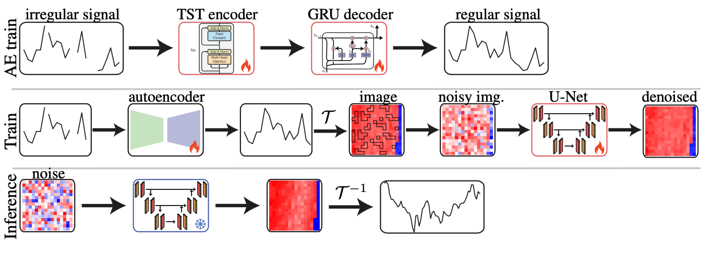

# ImagenI2R

[]()
[](https://imageni2r.vercel.app/)
[]()

## A Diffusion Model for Regular Time Series Generation from Irregular Data

**ImagenI2R** is a framework that generates **regular time series from irregularly-sampled data** by combining a **Time Series Transformer** for completion with a **vision-based diffusion model with masking**. It achieves **state-of-the-art generative performance** while being highly efficient and scalable.

### [Project Website](https://imageni2r.vercel.app/)
### [Paper](https://arxiv.org/abs/2410.19538)


## Overview

Generating realistic time series is critical for applications in healthcare, finance, and science, but irregular sampling and missing data make it challenging. ImagenI2R addresses this with a two-step approach: first, a Time Series Transformer (TST) completes irregular sequences, creating natural neighborhoods; second, a vision-based diffusion model with masking generates realistic time series while reducing reliance on imputed values. This combination ensures high-quality synthetic data, natural temporal patterns, and efficient training. ImagenI2R can be used to generate synthetic datasets, impute missing measurements, and benchmark models, achieving state-of-the-art performance with significant improvements in both accuracy and computational efficiency.

## Installation

### Prerequisites

- Python 3.8+
- CUDA-capable GPU (recommended)

### Setup
Download and set up the repository:
```bash
git clone https://github.com/azencot-group/ImagenI2R.git
cd ImagenI2R
conda create -n ImagenI2R python=3.9
conda activate ImagenI2R
pip install -r requirements.txt
```

### Data 

**Important**: You need to download all datasets from the provided Google Drive link and place them in the `data` folder.

1. Download all datasets from: [Google Drive Data Folder](https://drive.google.com/drive/folders/1fGGs6E5zlHxHiqqpGuQSESyEOt5GZpwg?usp=sharing)

2. Extract and place all files in the `data/` directory:
   ```
   data/
   ├── electricity.csv
   ├── energy.csv
   ├── ETTh1.csv
   ├── ETTh2.csv
   ├── ETTm1.csv
   ├── ETTm2.csv
   ├── stock.csv
   ├── weather.csv
   ├── mujoco_irregular.pt
   ├── mujoco_regular.pt
   └── mujoco.pt
   ```

## Usage

### Quick Start

Run with default configuration:

```bash
python run_irregular.py --config ./configs/seq_len_24/stock.yaml
```

### Configuration Options

The project supports three sequence lengths with pre-configured settings:

#### Sequence Length 24
```bash
python run_irregular.py --config ./configs/seq_len_24/[dataset_name].yaml
```

#### Sequence Length 96
```bash
python run_irregular.py --config ./configs/seq_len_96/[dataset_name].yaml
```

#### Sequence Length 768
```bash
python run_irregular.py --config ./configs/seq_len_768/[dataset_name].yaml
```

### Available Datasets

- `electricity` - Electricity consuming clients data
- `energy` - Energy consumption data
- `etth1`, `etth2` - Electricity Transformer Temperature (Hourly)
- `ettm1`, `ettm2` - Electricity Transformer Temperature (15-minute)
- `weather` - Weather measurements
- `stock` - Stock price data
- `sine` - Synthetic sine wave data
- `mujoco` - Physics simulation data

### Command Line Arguments

Key arguments you can override:

```bash
python run_irregular.py \
    --config ./configs/seq_len_96/electricity.yaml \
    --missing_rate 0.3 \
    --batch_size 32 \
    --epochs 1000 \
    --learning_rate 0.0001
```

#### Important Parameters

- `--missing_rate`: Proportion of missing data to simulate (default: 0.3)
- `--gaussian_noise_level`: Add noise to data (default: 0.0)
- `--batch_size`: Training batch size
- `--epochs`: Number of training epochs
- `--learning_rate`: Learning rate for optimization
- `--neptune`: Enable Neptune logging (requires setup)

## Configuration Files

Configuration files are organized by sequence length:

```
configs/
├── seq_len_24/    # Short sequences
├── seq_len_96/    # Medium sequences  
└── seq_len_768/   # Long sequences
```

Each contains dataset-specific YAML files with optimized hyperparameters.

## Example Configuration

```yaml
# configs/seq_len_96/weather.yaml
epochs: 1000
batch_size: 32
learning_rate: 0.0001
dataset: weather
seq_len: 96
delay: 6
embedding: 16
img_resolution: 8
input_channels: 12
diffusion_steps: 18
```

## Results

Models are automatically saved when achieving best discriminative scores. Checkpoints include:

- Model weights (diffusion model, TST encoder/decoder)
- Optimizer states
- EMA weights (if enabled)
- Evaluation scores
- Training arguments

Saved models location: `./saved_models/seq_len_{length}/{dataset}/missing_rate_{rate}/`

## Neptune Integration

To use Neptune logging:

1. Set up Neptune account and project
2. Configure `utils/loggers/neptune/project.txt`
3. Run with `--neptune true`

## Dependencies

- `torch>=2.7.1` 
- `numpy>=1.24.3` 
- `scipy>=1.11.2` 
- `scikit-learn>=1.3.0` 
- `omegaconf>=2.3.0` 
- `Pillow>=10.0.0` 
- `tqdm>=4.66.1` 

## Project Structure

```
├── configs/           # Configuration files by sequence length
├── data/             # Dataset files (download required)
├── metrics/          # Evaluation metrics implementation
├── models/           # Model architectures
├── utils/            # Utility functions and loggers
├── saved_models/     # Saved model checkpoints
├── run_irregular.py  # Main training script
└── requirements.txt  # Python dependencies
```

## BibTeX

```bibtex
@article{{fadlon2025diffusionmodelregulartimeseries,
  title={A Diffusion Model for Regular Time Series Generation from Irregular Data},
  author={Fadlon, Gal and Arbiv, Idan and Berman, Nimrod and Azencot, Omri},
  journal={Advances in Neural Information Processing Systems},
  volume={TODO},
  pages={TODO},
  year={2025}
}
```

